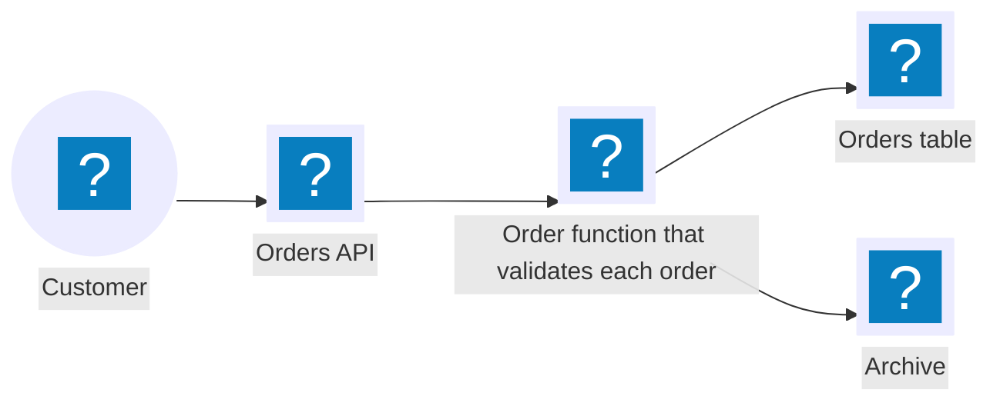
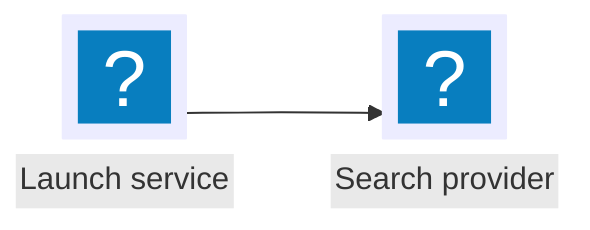
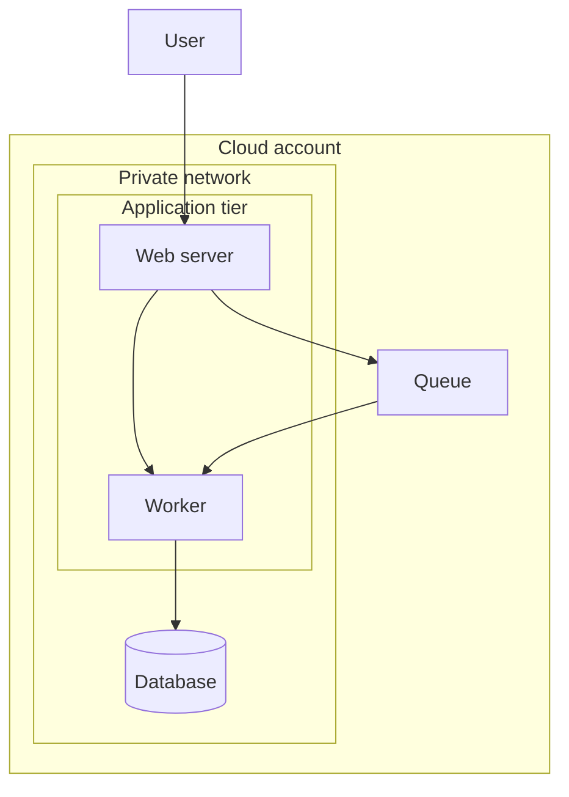
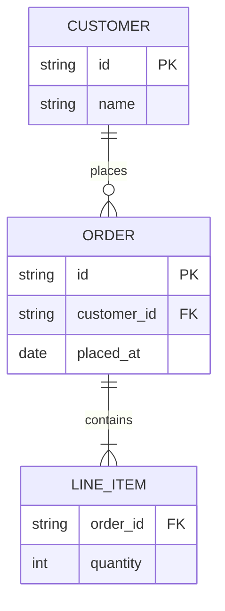

# Icon diagrams

Fixture document for the icons and diagram types of the diagram scopes contract.

## Icons

```mermaid
flowchart LR
  accTitle: Order system
  accDescr: A customer calls the orders API, which runs a function that stores orders in a table and an archive.
  customer@{ icon: "lucide:user", form: "circle", label: "Customer", pos: "b" }
  api@{ icon: "logos:aws-api-gateway", form: "square", label: "Orders API", pos: "b" }
  fn@{ icon: "logos:aws-lambda", form: "square", label: "Order function that validates each order", pos: "b" }
  table@{ icon: "logos:aws-dynamodb", form: "square", label: "Orders table", pos: "b" }
  archive@{ icon: "lucide:database", form: "square", label: "Archive", pos: "b" }
  customer --> api --> fn --> table
  fn --> archive
```

## Unknown icons

```mermaid
flowchart LR
  accTitle: Unknown icons
  accDescr: Two icon names outside the bundled set keep their labels.
  rocket@{ icon: "lucide:rocket", form: "square", label: "Launch service", pos: "b" }
  search@{ icon: "logos:google", form: "square", label: "Search provider", pos: "b" }
  rocket --> search
```

## Nested subgraphs

```mermaid
flowchart TB
  accTitle: Deployment
  accDescr: A user reaches a web server in the application tier, inside a private network of a cloud account.
  user[User] --> web
  subgraph account[Cloud account]
    subgraph network[Private network]
      subgraph tier[Application tier]
        web[Web server] --> worker[Worker]
      end
      db[(Database)]
    end
    queue[Queue]
  end
  web --> queue --> worker --> db
```

## Entities

```mermaid
erDiagram
  accTitle: Order entities
  accDescr: A customer places orders, and an order contains line items.
  CUSTOMER ||--o{ ORDER : places
  ORDER ||--|{ LINE_ITEM : contains
  CUSTOMER {
    string id PK
    string name
  }
  ORDER {
    string id PK
    string customer_id FK
    date placed_at
  }
  LINE_ITEM {
    string order_id FK
    int quantity
  }
```
